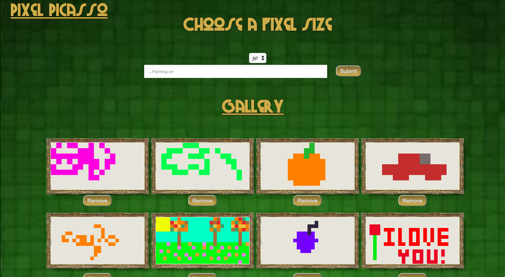
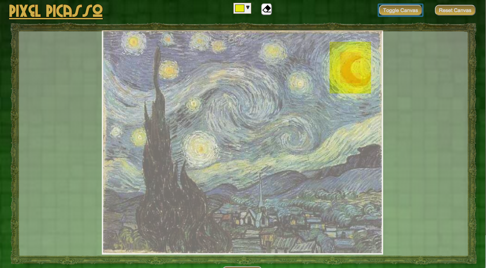
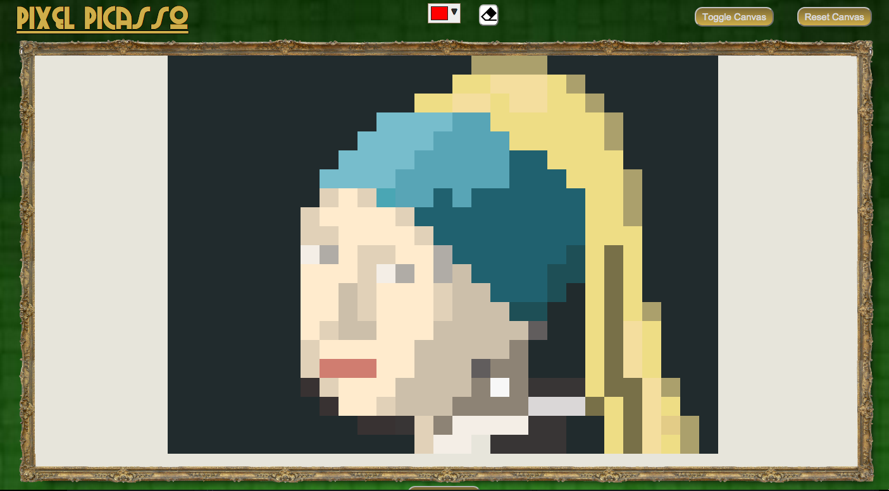

# Pixel Picasso

- Pixel Picasso is a pixel art painting application, built in the MEAN stack, that allows users to create, save, edit and remove paintings, and to view their saved paintings in a gallery

---

---

- Painters can import an image to underlay beneath the canvas as a tracing feature.

---

---

- Painters can choose te size of the pixels in their paintings

---

---

##Technologies

* Node.js
* Express.js
* Angular.js
* MongoDB

***
